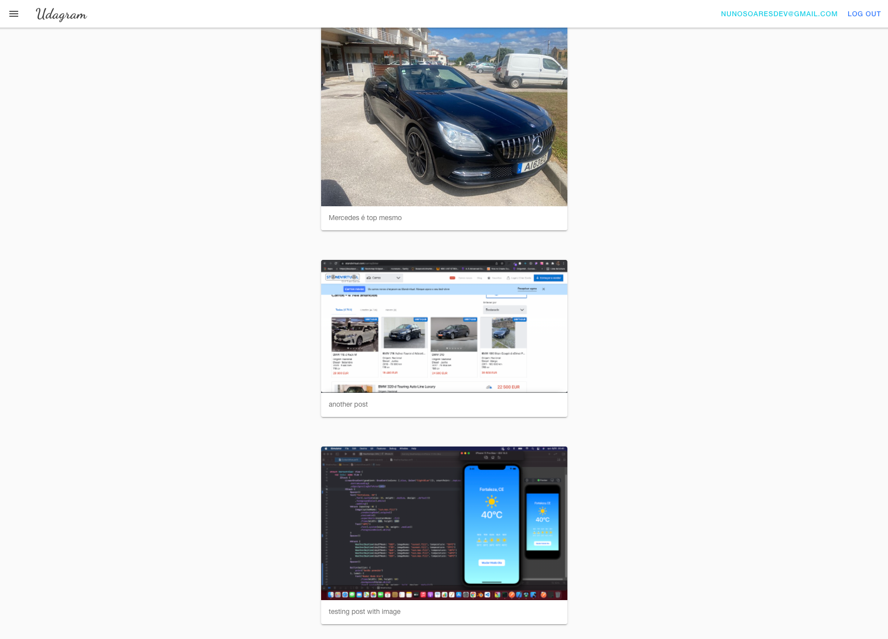

# Hosting a Full-Stack Application

This application is provided by Udacity as an alternative starter project. The udagram application is a fairly simple application that includes all the major components of a Full-Stack web application.

## Access Application

Visit this url to access the Application:  [http://udagram-fe.s3-website-us-east-1.amazonaws.com/](http://udagram-fe.s3-website-us-east-1.amazonaws.com/).

## Hosting

This Application is hosted on AWS. It uses 1 Elastic Beanstalk for the Backend API, 2 S3 Buckets, 1 for the frontend and another 1 for storage uploaded images, and 1 RDS database running Postgres, to save the data.

## CI|CD Pipeline

The source code is hosted on Github, and connected to CircleCI who is responsible for automatically deploy the application. When a developer push code to main branch, it triggers the pipeline.

