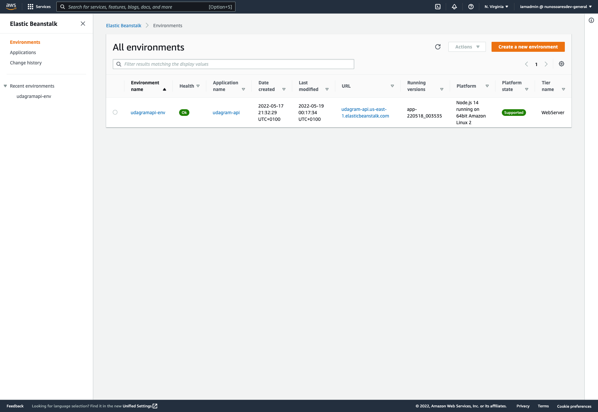
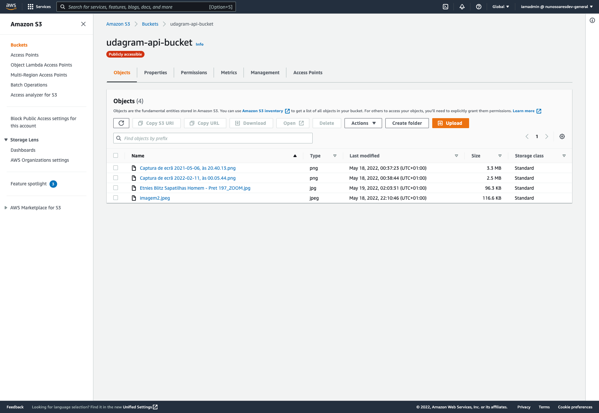

## Infrastructure Architecture

This Application is hosted on AWS. It uses 1 Elastic Beanstalk for the Backend API, 2 S3 Buckets, 1 for the frontend and another 1 for storage uploaded images, and 1 RDS database running Postgres, to save the data.

## Screenshots:

  AWS RDS - DB:

  
  
>

  AWS Elastic Beanstalk - BE:

  
  
>

  Buckets preview on dashboard

  
>

  AWS S3 - FE

  
>

  AWS S3 - Storage Uploaded Images

  
>
