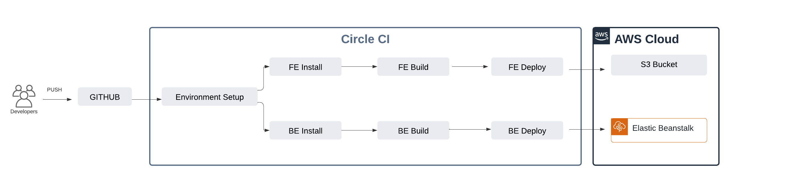
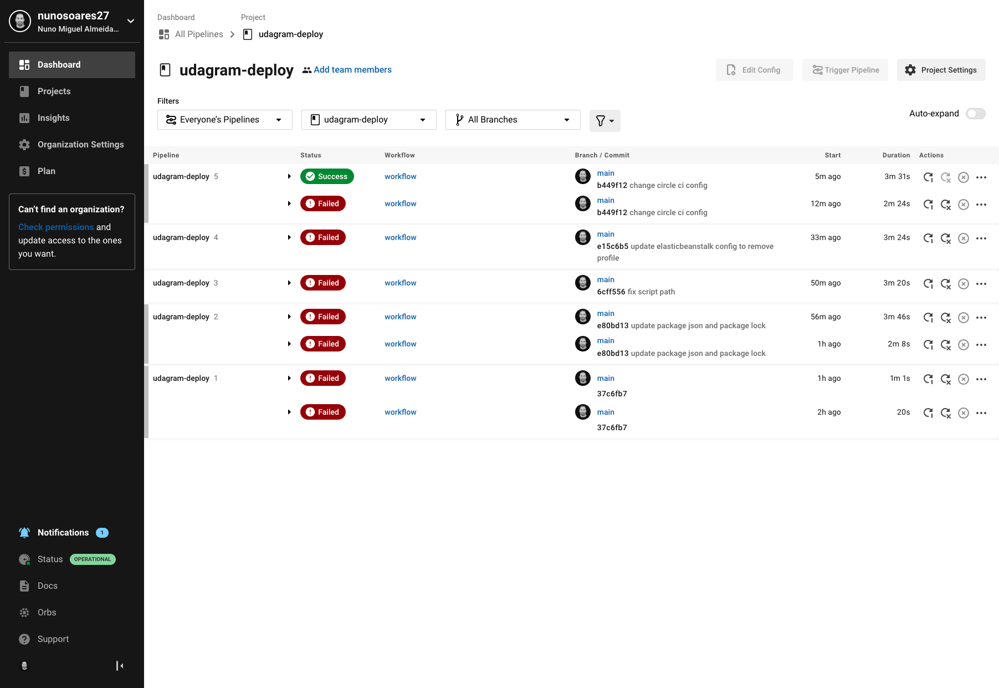
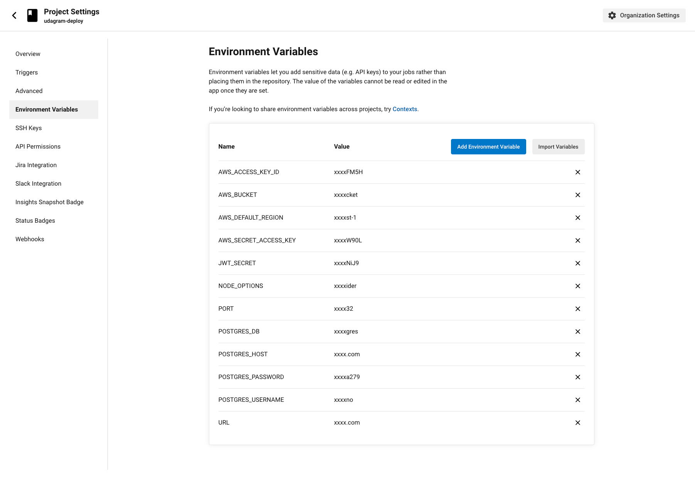
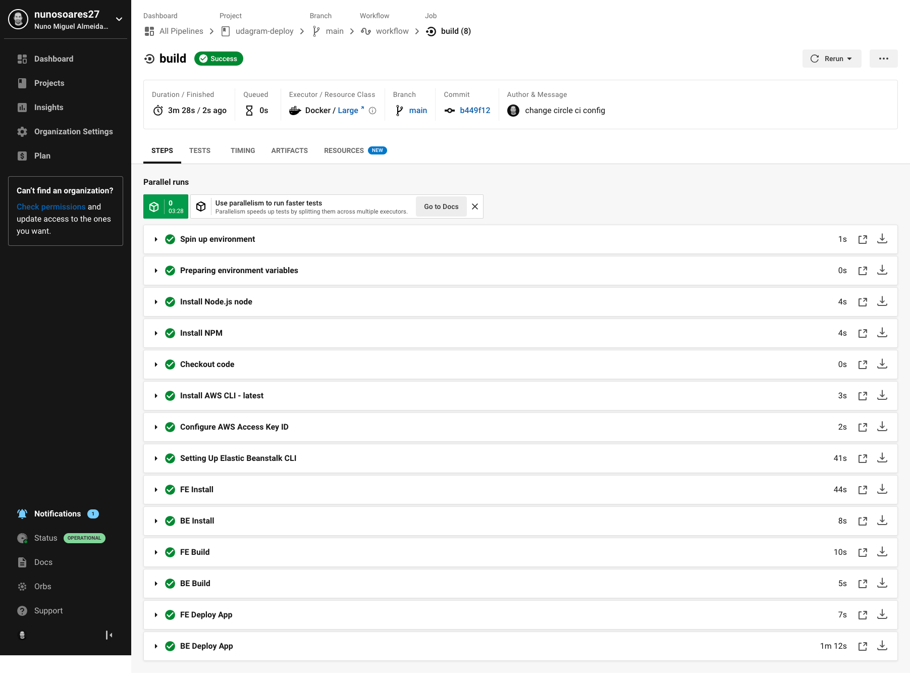
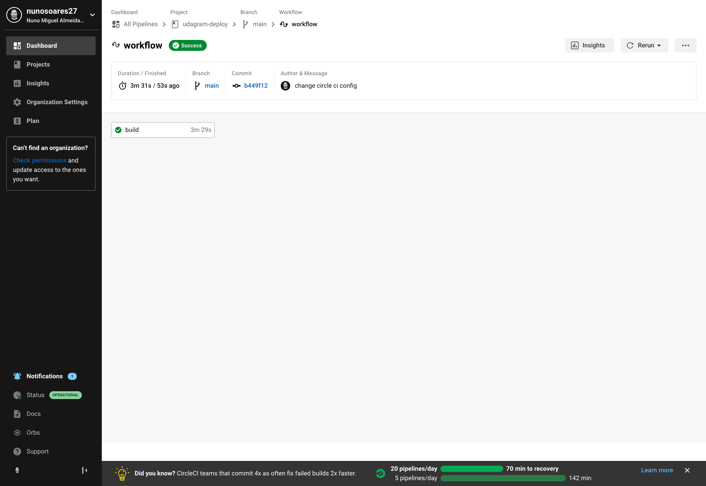

## CI|CD Pipeline

The source code is hosted on Github, and connected to CircleCI who is responsible for automatically deploy the application. When a developer push code to main branch, it triggers the pipeline.

## Screenshots:

  

  

  

  